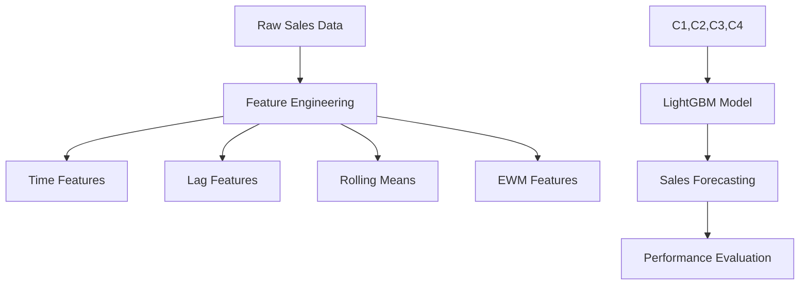

# Retail Demand Forecasting with LightGBM 📊


A comprehensive implementation of retail demand forecasting using LightGBM, featuring advanced time series feature engineering and custom evaluation metrics.

## 📖 Table of Contents
- [Project Overview](#-project-overview)
- [Technical Architecture](#-technical-architecture)
- [Installation & Setup](#-installation--setup)
- [Implementation Details](#-implementation-details)
- [Feature Engineering](#-feature-engineering)
- [Model Training](#-model-training)
- [Results & Visualization](#-results--visualization)

## 🎯 Project Overview

### 🔬 Key Features
- **Time Series Processing**
  - Date-based feature extraction
  - Lag feature generation
  - Rolling mean calculations
  - Exponential weighted means
- **Advanced Analytics**
  - Store-level analysis
  - Item-level forecasting
  - Custom SMAPE evaluation
  - Robust validation strategy

## 🛠 Technical Architecture

### System Components


### Dependencies
```python
# requirements.txt
numpy>=1.20.0
pandas>=1.3.0
lightgbm>=3.3.0
matplotlib>=3.4.0
seaborn>=0.11.0
statsmodels>=0.13.0
```

## 💻 Installation & Setup

### System Requirements
- Python 3.8+
- 8GB RAM (minimum)
- Storage for data processing

### Quick Start
```bash
# Install dependencies
pip install numpy pandas lightgbm matplotlib seaborn statsmodels

# Load data
train = pd.read_csv('train.csv', parse_dates=['date'])
test = pd.read_csv('test.csv', parse_dates=['date'])
```

## 🔬 Implementation Details

### Feature Engineering Components

#### Time-Based Features
```python
def create_time_features(df):
    df['month'] = df.date.dt.month
    df['day_of_month'] = df.date.dt.day
    df['day_of_year'] = df.date.dt.dayofyear
    df['week_of_year'] = df.date.dt.weekofyear
    df['day_of_week'] = df.date.dt.dayofweek
    df['year'] = df.date.dt.year
    df["is_wknd"] = df.date.dt.weekday // 4
    df['is_month_start'] = df.date.dt.is_month_start.astype(int)
    df['is_month_end'] = df.date.dt.is_month_end.astype(int)
    return df
```

#### Lag Features
```python
def lag_features(dataframe, lags):
    """
    Creates lagged features with random noise.
    
    Args:
        dataframe (pd.DataFrame): Input dataframe
        lags (list): List of lag periods
    """
    for lag in lags:
        dataframe['sales_lag_' + str(lag)] = dataframe.groupby(["store", "item"])['sales'].transform(
            lambda x: x.shift(lag)) + random_noise(dataframe)
    return dataframe
```

#### Rolling Mean Features
```python
def roll_mean_features(dataframe, windows):
    """
    Creates rolling mean features with triangular window.
    
    Args:
        dataframe (pd.DataFrame): Input dataframe
        windows (list): List of window sizes
    """
    for window in windows:
        dataframe['sales_roll_mean_' + str(window)] = dataframe.groupby(["store", "item"])['sales'].transform(
            lambda x: x.shift(1).rolling(window=window, min_periods=10, win_type="triang").mean())
    return dataframe
```

## 📊 Model Training

### Custom SMAPE Evaluation
```python
def smape(preds, target):
    """
    Calculates Symmetric Mean Absolute Percentage Error.
    
    Args:
        preds: Model predictions
        target: Actual values
    
    Returns:
        float: SMAPE score
    """
    n = len(preds)
    masked_arr = ~((preds == 0) & (target == 0))
    preds, target = preds[masked_arr], target[masked_arr]
    num = np.abs(preds - target)
    denom = np.abs(preds) + np.abs(target)
    smape_val = (200 * np.sum(num / denom)) / n
    return smape_val
```

### LightGBM Configuration
```python
lgb_params = {
    'metric': {'mae'},
    'num_leaves': 10,
    'learning_rate': 0.02,
    'feature_fraction': 0.8,
    'max_depth': 5,
    'verbose': 0,
    'num_boost_round': 2000,
    'early_stopping_rounds': 200,
    'nthread': -1
}
```

## 📈 Results & Visualization

### Model Performance
```python
def plot_store_forecast(forecast_df, store_id, item_id):
    """
    Plots forecasted sales for specific store and item.
    
    Args:
        forecast_df: DataFrame with forecasts
        store_id: Store identifier
        item_id: Item identifier
    """
    forecast_df[
        (forecast_df.store == store_id) & 
        (forecast_df.item == item_id)
    ].set_index("date").sales.plot(
        figsize=(20,9),
        legend=True,
        label=f"Store {store_id} Item {item_id} Forecast"
    )
```

## 🤝 Contributing

### Guidelines
1. Fork repository
2. Create feature branch
3. Implement changes
4. Add tests
5. Submit pull request

### Code Style
- Follow PEP 8
- Document all functions
- Maintain clean notebook outputs

## 📄 License

This project is licensed under the MIT License.
